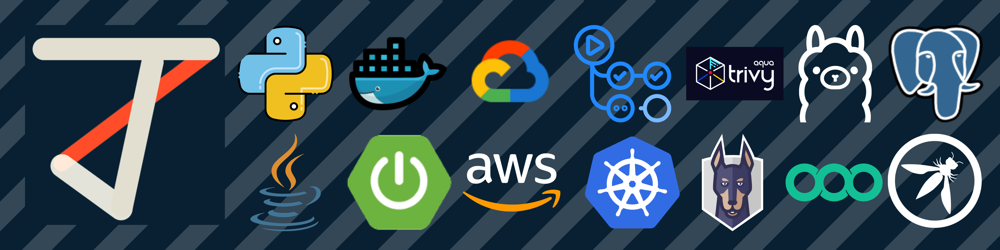

  

<h1 align="center">Hola, soy Jeronimo Pineda 👋</h1>

  <strong>Ingeniero de Sistemas @ Universidad de los Andes</strong> 
  Especializado en <strong>DevSecIAOps</strong>, Arquitectura Backend y Programación Defensiva.

  
  

---

### 🛡️ Sobre Mí

Soy un ingeniero de sistemas enfocado en la intersección del desarrollo backend robusto y la seguridad proactiva de la infraestructura y los sistemas de Inteligencia Artificial. Mi experiencia core incluye el diseño de arquitecturas limpias y la automatización de compuertas de seguridad (SAST/SCA/Fuzzing) dentro del ciclo de vida del software. Me apasiona el hardening de sistemas basados en LLMs, mitigando alucinaciones y vectores de ataque como la inyección de prompts.

- ⚙️ **Mi Filosofía:** La seguridad no debe ser un cuello de botella, sino un componente nativo integrado en el código desde el día cero.
- 🎓 **Educación:** Ingeniería de Sistemas y Computación en la Universidad de los Andes.

---

### 🛠️ Ecosistema Técnico Integrado

A continuación se detallan las tecnologías y herramientas que implemento en mis flujos de desarrollo y laboratorios de automatización, organizadas tal como se estructuran en mi arquitectura visual:

<table align="center">
  <tr>
    <td align="center" width="14%"><strong>Core</strong></td>
    <td align="center" width="14%"><strong>Backend</strong></td>
    <td align="center" width="14%"><strong>Cloud</strong></td>
    <td align="center" width="14%"><strong>CI/CD & Infra</strong></td>
    <td align="center" width="14%"><strong>AppSec (SCA)</strong></td>
    <td align="center" width="14%"><strong>AI & SAST</strong></td>
    <td align="center" width="14%"><strong>Data & Standards</strong></td>
  </tr>
  <tr>
    <td align="center" valign="top">
       
      
    </td>
    <td align="center" valign="top">
       
      
    </td>
    <td align="center" valign="top">
       
      
    </td>
    <td align="center" valign="top">
       
      
    </td>
    <td align="center" valign="top">
       
      
    </td>
    <td align="center" valign="top">
       
      
    </td>
    <td align="center" valign="top">
       
      
    </td>
  </tr>
</table>

---

### 📂 Proyectos Destacados

#### 🤖 Componente Inteligente Backend — Motor EVRAG (ArchIA)
Desarrollo del componente inteligente backend basado en Python para un ecosistema de arquitectura de software, utilizando una evolución de generación aumentada por recuperación orientada a video (EVRAG). El sistema interactúa de manera eficiente con clientes SPA modernos para resolver consultas complejas de diseño arquitectónico.

#### 🛡️ Laboratorio Personal de Automatización DevSecIAOps
Entorno limpio *(clean-room)* local diseñado para simular pipelines de despliegue seguro y endurecimiento de modelos de IA.
- **Seguridad de Código e Infraestructura:** Integración de compuertas automatizadas con `Semgrep` (SAST) para análisis estático defensivo y `Trivy`/`Snyk` (SCA) para el escaneo de vulnerabilidades críticas en contenedores de Docker.
- **LLM Red Teaming:** Implementación del framework `Garak` para ejecutar simulaciones de fuzzing y evaluar la resistencia de endpoints frente a inyecciones de prompts y fugas de contexto.

#### 🗃️ Contribuciones Open Source — Bug Hunting en KDE Connect
Auditoría y corrección de fallos críticos en el ciclo de vida de descubrimiento de dispositivos dentro del ecosistema de código abierto.
- **Bug ID 520075 / MR !649:** Identificación y mitigación de fugas de memoria persistentes causadas por el manejo inadecuado de listeners de fragmentos.
- **Optimización Técnica (MO5):** Rediseño e implementación del mecanismo de reutilización del listener en el descubrimiento mDNS, estabilizando el consumo de recursos en entornos móviles.
